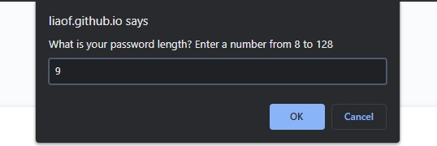
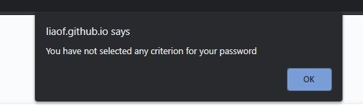
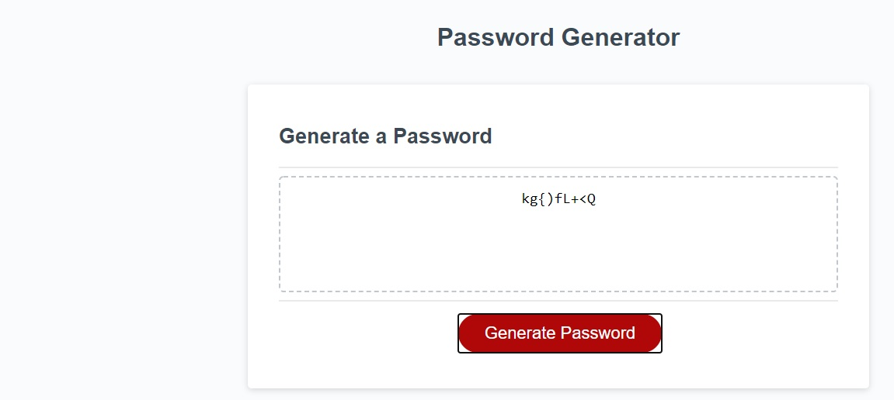

# Password Generator Starter Code

This week I've created a password generator with user defined parameters. 

This particular generator allows the user to select the number of characters in the password, as well as choose what type of characters are allowed to compose said password. If there is no character set selected, we can not logically generate a password with user defined parameters, so the script assumes the operator has made an error and reruns the pertinent parts.

## Screenshots

The password length selection 
 
 
Warning message when no criteria have been selected 
 
 
The generated password, this one has all 4 char sets in it 
 

### Resources used

[This guy's question]{https://stackoverflow.com/questions/1497481/javascript-password-generator}